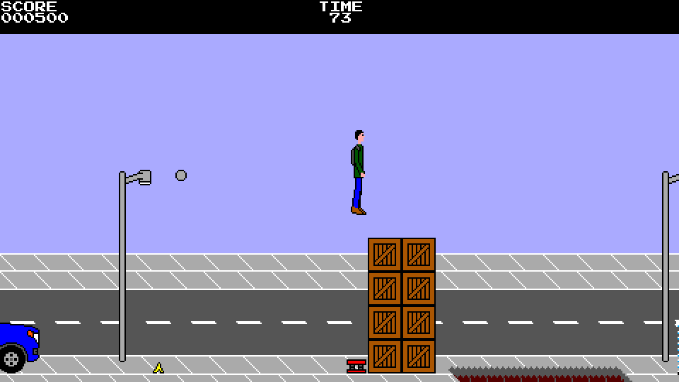
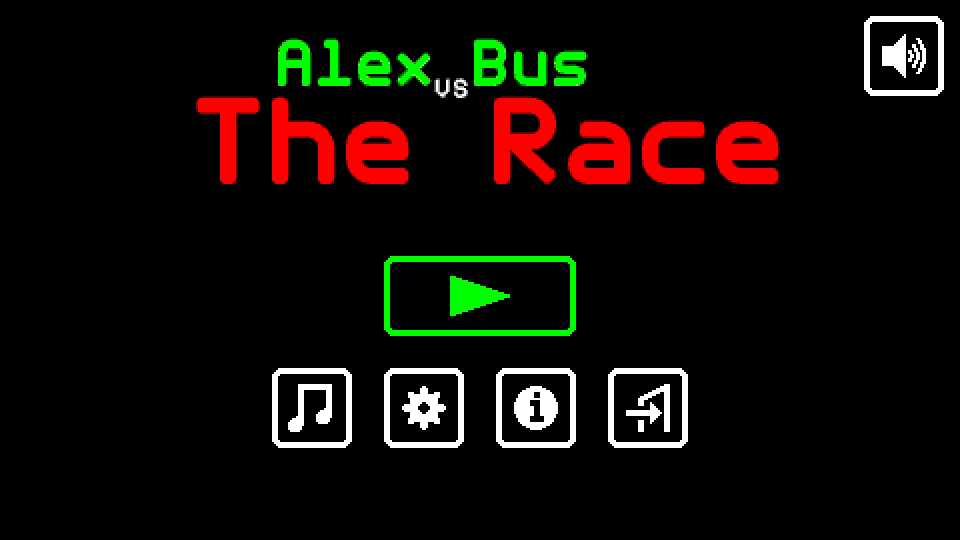

# Alex vs Bus: The Race

**Alex vs Bus: The Race** is a platform runner game for Android and PCs with
Java in which Alex is just a man who depends on public transportation and needs
to run in order to catch the bus, or else he will have to wait an eternity for
the next bus to come.

**Note: not officially on Google Play.** Someone has published the game on
Google Play without having contacted us and charges for it. It is not official
and we cannot ensure it is identical to the official build and up to date. At
present, the game is officially distributed only through GitHub, where it is
free of charge.

The graphical and sound style is mostly inspired by the 8-bit era, although the
game is not faithful to all of the technical limitations of the period.

The library used by the game is libGDX (https://libgdx.com) and the source code
repository can be found at https://github.com/M374LX/alexvsbus-java.






## Gameplay

The game can be described as a "platform runner" (not an endless runner). In
each level, the player has 90 seconds to catch the bus while jumping over holes,
banana peels, crates, and other obstacles.


## Controls

The game can be controlled by using a keyboard, gamepad/joystick, or touchscreen
buttons.

When using a keyboard, the controls are:

**Arrow keys/WASD:** Move character; select dialog item

**Up arrow/W:** Jump

**Ctrl/Spacebar:** Jump; confirm selected dialog item

**Enter (aka Return):** Confirm selected dialog item

**Escape:** Pause; close dialog

**F5:** Toggle fullscreen (PC only)

**F6:** Toggle audio

**F7:** Toggle scanlines

On French (AZERTY) keyboards, W becomes Z and A becomes Q.

On Android, the Back button has the same effect as Escape.

Touchscreen buttons appear by default on Android, while these can be enabled on
PC by using the command line option ``--touch``. Dialog items can also be
selected by touching them.


## Downloading

To avoid the need to build the game from source, it can be downloaded in
pre-built form from https://github.com/M374LX/alexvsbus-java/releases. The .jar
file is for PC, while the .apk file is for Android.


## Running on PC

On PC (including Windows and Linux), the game requires Java (https://java.com).
On Debian, it can be installed by running the command:
```
apt install openjdk-17-jre
```

After installing Java and downloading the .jar file, on Windows, a double-click
on the .jar file should be enough to start the game. To start it from the CLI,
the command is:
```
java -jar alexvsbus-desktop-pre6.jar
```


## Command line options (PC only)

On PC, the game supports some command line options. For example, to use the
option --fullscreen, the full command is:
```
java -jar alexvsbus-desktop-pre6.jar --fullscreen
```

As of the latest pre-release, the options are:
```
-h, --help             Show this usage information and exit
-v, --version          Show version and license information and exit
-f, --fullscreen       Run in fullscreen mode
-w, --windowed         Run in windowed mode
--window-scale <scale> Set the window scale (1 to 3)
--audio-on             Enable audio output
--audio-off            Disable audio output
--resizable            Make the window resizable
--scanlines-on         Enable scanlines visual effect
--scanlines-off        Disable scanlines visual effect
--touch                Enable touchscreen controls, which can also be
                       simulated by using the mouse
--touch-buttons-on     Enable left, right, and jump buttons on
                       touchscreen (visible only if --touch is also used)
--touch-buttons-off    Disable left, right, and jump buttons on
                       touchscreen
--vscreen-size <size>  Set the size of the virtual screen (vscreen)

For --vscreen-size, the size can be either "auto" or a width and a height
separated by an "x" (example: 480x270), with the supported values listed
below.

Supported width values:
480
432
416
320
256

Supported height values:
270
256
240
224
192
```

The following additional options are available as of the latest commit in the
``main`` branch:
```
-c, --config <file>    Set the config file to use
--music-on             Enable music
--music-off            Disable music
--sfx-on               Enable sound effects
--sfx-off              Disable sound effects
--fixed-window-mode    Simulate the mobile version's inability to toggle
                       between fullscreen and windowed mode and to change
                       the window scale
--mobile               As a shorthand for --fixed-window-mode and --touch,
                       simulate the mobile version
```


## Building from source

In order to build the game from source, the Java Development Kit (JDK) is
required. The tested version is 17, which can be downloaded from
https://jdk.java.net/java-se-ri/17.

As a result of being a libGDX project, the game uses Gradle as its build system.
The source tree contains the Gradle wrapper, which downloads the appropriate
Gradle version and the dependencies automatically. For this reason, an Internet
connection is required when building the game for the first time.

### PC

The executable .jar file can be built by running the following command on Unix
systems (including Linux):
```
./gradlew desktop:dist
```

On Windows, replace "./gradlew" with "gradlew.bat".

The built .jar file will be at ``desktop/build/libs/desktop-pre6.jar``.

Alternatively, the following command allows running the game without keeping the
build:
```
./gradlew desktop:run
```

### Android

In order to build for Android, the Android SDK is required in addition to the
JDK version 8. It can be downloaded from https://developer.android.com/studio.
The command line tools are enough, without the need for Android Studio.

The required SDK packages, which can be installed by using ``sdkmanager``, are
``build-tools;33.0.2`` and ``platforms;android-32``. The versions here are the
ones that have been tested, but later versions might also work. A few other
packages will be installed automatically as dependencies. The NDK can be
optionally installed to prevent messages like "Unable to strip library due to
missing strip tool" and "Compatible side by side NDK version was not found",
although it does not significantly shrink the .apk file.

The file ``local.properties`` needs to be present and point to the Android SDK
installation directory, like so:
```
sdk.dir=/path/to/android/sdk
```

The command to build the .apk file for Android on Unix systems (including Linux)
is:
```
./gradlew android:assembleDebug
```

On Windows, replace "./gradlew" with "gradlew.bat".

The built .apk file will be at
``android/build/outputs/apk/debug/android-debug.apk``.

At present, only debug builds have been tested.

### Cleaning

To clean the source tree after the project is built, the following command can
be used on Unix systems (including Linux):
```
./gradlew clean
```

On Windows, replace "./gradlew" with "gradlew.bat".

