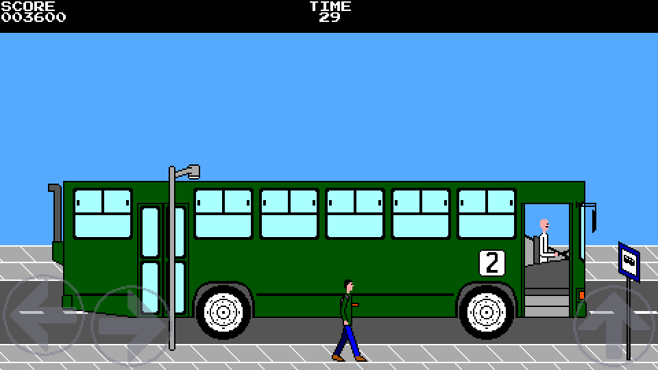
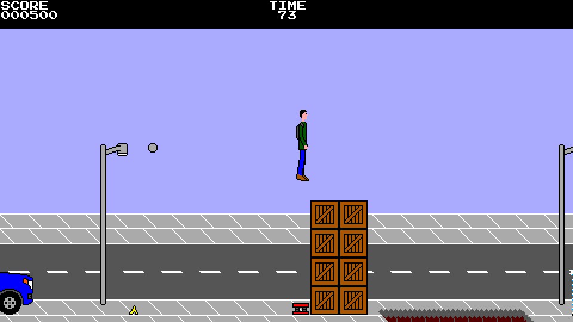
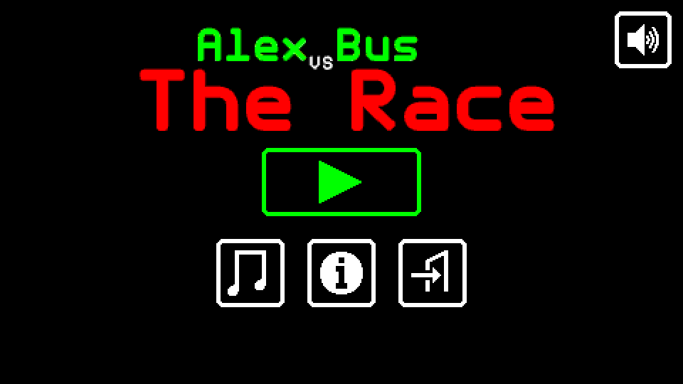

# Alex vs Bus: The Race

**Alex vs Bus: The Race** is a platform runner game for Android and PCs with
Java in which Alex is just a man who depends on public transportation and needs
to run in order to catch the bus, or else he will have to wait an eternity for
the next bus to come.

As it is currently a pre-release, not all planned features are present yet, but
it is fully playable.

The graphical and sound style is mostly inspired by the 8-bit era, although the
game is not faithful to all of the technical limitations of the period.

The library used by the game is libGDX (https://libgdx.com) and the source code
repository can be found at https://github.com/M374LX/alexvsbus-java.






## Gameplay

The game can be described as a "platform runner" (not an endless runner). In
each level, the player has 90 seconds to catch the bus while jumping over holes,
banana peels, crates, and other obstacles.


## Controls

On PC, the left and right arrow keys move the character, while Ctrl or the
spacebar causes him to jump. F5 changes the window size and F6 toggles the
audio on/off.

On Android, the character is controlled by touchscreen buttons.

Game controllers, like gamepads and joysticks, are also supported on both PC and
Android.


## Downloading

To avoid the need to build the game from source, it can be downloaded in
pre-built form from https://github.com/M374LX/alexvsbus-java/releases. The .jar
file is for PC, while the .apk file is for Android.


## Running on PC

On PC (including Windows and Linux), the game requires Java (https://java.com).
On Debian, it can be installed by running the command:
```
apt install openjdk-11-jre
```

After installing Java and downloading the .jar file, on Windows, a double-click
on the .jar file should be enough to start the game. To start it from the CLI,
the command is:
```
java -jar alexvsbus-desktop-pre1.jar
```


## Command line options (PC only)

On PC, the game supports some command line options. For example, to use the
option --fullscreen, the full command is:
```
java -jar alexvsbus-desktop-pre1.jar --fullscreen
```

The options are:
```
-h, --help          Show this usage information and exit
-v, --version       Show version and license information and exit
-f, --fullscreen    Run in fullscreen mode
-w, --window <size> Run in windowed mode with the specified window size:
                    1 for 1x window size, 2 for 2x, and 3 for 3x
--audio-on          Enable audio output
--audio-off         Disable audio output
--resizable         Make the window resizable
--touch             Enable touchscreen controls, which can also be simulated by
                    using the mouse
```


## Building from source

In order to build the game from source, the Java Development Kit (JDK) is
required. Android still requires version 8 of the JDK. It can be downloaded from
https://www.oracle.com/java/technologies/javase/javase-jdk8-downloads.html.

As a result of being a libGDX project, the game uses Gradle as its build system.
The source tree contains the Gradle wrapper, which downloads the appropriate
Gradle version and the dependencies automatically. For this reason, an Internet
connection is required when building the game for the first time.

### PC

The executable .jar file can be built by running the following command on Unix
systems (including Linux):
```
./gradlew desktop:dist
```

On Windows, replace "./gradlew" with "gradlew.bat".

The built .jar file will be at ``desktop/build/libs/desktop-pre1.jar``.

Alternatively, the following command allows running the game without keeping the
build:
```
./gradlew desktop:run
```

### Android

In order to build for Android, the Android SDK is required in addition to the
JDK version 8. It can be downloaded from https://developer.android.com/studio.
The command line tools are enough, without the need for Android Studio.

The required SDK packages, which can be installed by using ``sdkmanager``, are
``build-tools;29.0.3`` and ``platforms;android-29``. The versions here are the
ones that have been tested, but later versions might also work. A few other
packages will be installed automatically as dependencies. The NDK can be
optionally installed to prevent messages like "Unable to strip library due to
missing strip tool" and "Compatible side by side NDK version was not found",
although is does not significantly shrink the .apk file.

The file ``local.properties`` needs to be present and point to the Android SDK
installation directory, like so:
```
sdk.dir=/path/to/android/sdk
```

The command to build the .apk file for Android on Unix systems (including Linux)
is:
```
./gradlew android:assembleDebug
```

On Windows, replace "./gradlew" with "gradlew.bat".

The built .apk file will be at
``android/build/outputs/apk/debug/android-debug.apk``.

At present, only debug builds have been tested.

### Cleaning

To clean the source tree after the project is built, the following command can
be used on Unix systems (including Linux):
```
./gradlew clean
```

On Windows, replace "./gradlew" with "gradlew.bat".


## Planned features

Features planned for the final release include:

* A "super" difficulty

* A different cutscene for each level when reaching the goal

* An ending sequence

* More documentation

